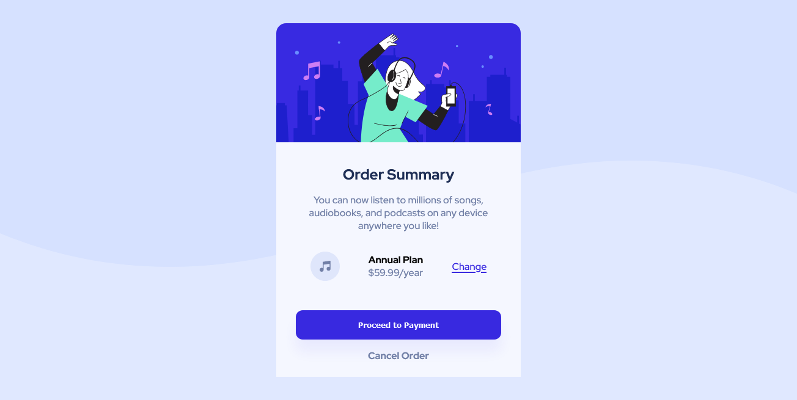

# Frontend Mentor - Order summary card solution

This is a solution to the [Order summary card challenge on Frontend Mentor](https://www.frontendmentor.io/challenges/order-summary-component-QlPmajDUj). 

## Table of contents

- [Overview](#overview)
  - [The challenge](#the-challenge)
  - [Screenshot](#screenshot)
  - [Links](#links)
- [My process](#my-process)
  - [Built with](#built-with)
  - [What I learned](#what-i-learned)
  - [Continued development](#continued-development)
  - [Useful resources](#useful-resources)
- [Author](#author)
- [Acknowledgments](#acknowledgments)

**Note: Delete this note and update the table of contents based on what sections you keep.**

## Overview

### The challenge

Users should be able to:

- See hover states for interactive elements

### Screenshot



### Links

- Live Site URL: [Github Pages](https://thiagovasc.github.io/Order-Summary/)
- Solution URL: [Solution submitted on frontend menthor](https://www.frontendmentor.io/solutions/responsive-landing-page-using-flexbox-oXT-T_NF5)

## My process

### Built with

- Semantic HTML5 markup
- CSS custom properties
- Flexbox


### What I learned

I love these challenges because you can learn a lot practicing and it's also possible to assert prior knowledges 

```css
@media screen and (max-width: 700px){
    body {
        background-image: url("images/pattern-background-mobile.svg");
        background-repeat: no-repeat;
    }
    
}
```

### Continued development

I want to keep practicing these challenges to improve my knowledge in css and responsiveness so I can start doing challenges that involve js

### Useful resources

- [MDN webdocs](https://developer.mozilla.org/pt-BR/) - I don't think all documentation is easy/fluid to read but I believe it's always good to read them so you can directly interpret what is written and not just rely on tutorials


## Author

- Website - [Thiago Vasoncelos](https://thiagovasc.github.io/)
- Frontend Mentor - [@Thiagovasc](https://www.frontendmentor.io/profile/thiagovasc)
- Github - [@thiagovasc](https://github.com/Thiagovasc)


## Acknowledgments

Checking the feedback that is passed on the frontend menthor platform is always good, going back to the project to improve it's also great, we can't always reach 100% on the first try so persistence is the key